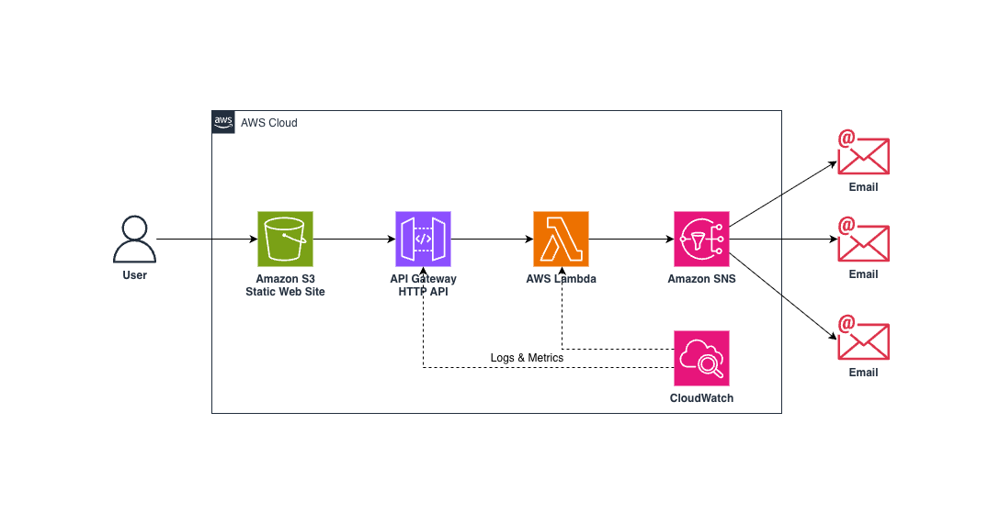

# 📣 Event Announcement System

Serverless, API-Driven Notification System on AWS

## 📌 Overview

This project is a fully serverless event announcement system built using AWS managed services.
It allows users to submit event details through a static web interface, processes those requests via a secure backend API, and distributes announcements to subscribers via email — all without managing servers.

The system demonstrates **serverless architecture, API-driven design, event-based messaging,** and **AWS best practices** for security, scalability, and observability.

## 🎯 Problem Statement

Organizations often rely on manual or tightly coupled systems to announce events, which can be:
- Time-consuming
- Hard to scale
- Difficult to maintain
- Prone to security and reliability issues

This project addresses those challenges by providing a **cloud-native, serverless solution** for publishing and distributing event announcements efficiently.

## 💡 Solution Summary

A static web frontend hosted on Amazon S3 sends event data to a backend API.
The backend validates requests and publishes announcements to a messaging service, which automatically delivers notifications to subscribed recipients.

### Processing Flow
1. User submits event details via a web form
2. Browser sends a POST request to Amazon API Gateway
3. API Gateway invokes an AWS Lambda function
4. Lambda validates the request and publishes the announcement to Amazon SNS
5. SNS distributes the announcement to subscribed email recipients
6. Logs are recorded in Amazon CloudWatch for monitoring and debugging

This approach is **cost-efficient, scalable**, and **fully managed**.

## 🏗️ Architecture – AWS Services Used
- **Amazon S3** – Static website hosting (frontend)
- **Amazon API Gateway (HTTP API)** – Public API endpoint
- **AWS Lambda** – Serverless backend logic
- **Amazon SNS (Simple Notification Service)** – Event notification distribution
- **Amazon CloudWatch** – Logging and monitoring
- **AWS IAM** – Secure service-to-service access

**Figure: Serverless Event Announcement System Architecture**  
Users submit event details through a static web interface hosted on Amazon S3.  
Requests are routed via Amazon API Gateway (HTTP API) to an AWS Lambda function, which validates the request and publishes announcements to Amazon SNS.  
SNS distributes notifications to subscribed email recipients.  
Logging and monitoring are handled using Amazon CloudWatch.
  
## ⚙️ Key Design Decisions
### Serverless-First Architecture
- No servers to provision or manage
- Automatic scaling
- Pay-per-use pricing model

### API-Driven Design
- Clear separation between frontend and backend
- Stateless HTTP API using API Gateway
- Easy to extend with authentication or additional consumers

### Event-Based Messaging
- SNS decouples message publishing from delivery
- Supports fan-out to multiple subscribers
- Easily extensible to SMS, SQS, or additional endpoints

### Security by Design
- Dedicated IAM role for Lambda
- Least-privilege permissions (SNS + CloudWatch only)
- No AWS credentials hardcoded
- Public demo API key used only as a lightweight request gate
- CORS configured to restrict browser access to the frontend origin

## 🧪 How It Works
1. Open the static website hosted on Amazon S3
2. Fill in:
   - Event title
   - Event date
   - Event description
3. Submit the form
4. Backend validates the request
5. Announcement email is delivered via Amazon SNS

No infrastructure management or manual intervention required.

## 📘 Detailed Setup Guide
For step-by-step AWS configuration and deployment instructions, see:

👉 [Setup Guide](docs/setup-guide.md)

## 🔐 Security & Reliability
- IAM roles scoped strictly to required services
- Managed AWS services provide high availability
- CloudWatch logs enabled for:
  - API Gateway access logging
  - Lambda execution logging
- Designed to handle increased request volume automatically

## 🧩 Challenges & Learnings
### 1️⃣ Handling Browser CORS with Secure APIs
**Challenge:**
When introducing custom headers (such as an API key), browser requests require proper CORS preflight handling, which can block requests if misconfigured.

**Learning:**
CORS must explicitly allow:
- Custom headers (x-api-key)
- HTTP methods (POST, OPTIONS)
- Specific frontend origins
  Correct CORS configuration is critical for browser-based APIs.

### 2️⃣ API Key Usage in Frontend Applications
**Challenge:**
API keys placed in frontend code are inherently public and cannot be treated as secrets.

**Learning:**
The API key in this project is intentionally treated as a **public demo key** and used only as a lightweight request filter.
In production systems, authentication should be handled using **Amazon Cognito**, JWTs, or a backend proxy.

### 3️⃣ Applying Least-Privilege IAM Correctly
**Challenge:**
It is easy to over-permission Lambda roles by attaching unnecessary policies.

**Learning:**
The Lambda function only requires:
- SNS permissions to publish messages
- CloudWatch permissions for logging
  Removing unused permissions (such as S3 or DynamoDB access) improves security    and demonstrates best practices.

## ✅ Summary
This project showcases:
- Serverless application design
- Secure API development
- Event-driven messaging with SNS
- Real-world frontend-to-backend interaction
- AWS observability and logging
- Cloud security best practices

